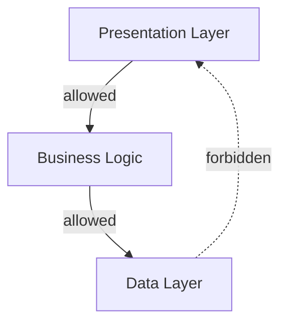

# Architectural Rules Implementation Plan

## Executive Summary

This document outlines the design and implementation plan for adding **architectural rules documentation** to dokken. This feature introduces a second documentation mode where rules define constraints that code must follow, complementing the existing descriptive documentation that reflects what code currently does.

**Core Distinction:**

- **Technical Documentation** (current): Code is truth, docs describe "what is"
- **Architectural Rules** (new): Rules are truth, code must conform to "what should be"

---

## Motivation

### Problem Statement

Dokken currently excels at keeping documentation synchronized with code changes. However, it lacks a mechanism to:

1. **Enforce architectural constraints** before they are violated
2. **Prevent regression** of intentional design decisions
3. **Gate CI/CD pipelines** based on architectural compliance
4. **Document architectural boundaries** as enforceable rules rather than descriptive prose

### Use Cases

**Use Case 1: Module Dependency Enforcement**

```
Rule: "The data layer must not import from the presentation layer"
Violation: data/repository.py imports from ui/components.py
Result: CI fails with architectural drift error
```

**Use Case 2: Pattern Enforcement**

```
Rule: "All database access must go through the Repository pattern"
Violation: Service layer directly instantiates SQLAlchemy models
Result: CI fails, suggests moving logic to repository
```

**Use Case 3: Security Constraint**

```
Rule: "Authentication logic must only exist in auth/ module"
Violation: New authentication code added to api/routes.py
Result: CI fails, enforces security boundary
```

**Use Case 4: Performance Requirement**

```
Rule: "Cache layer must intercept all external API calls"
Violation: New external API client bypasses cache
Result: CI fails, ensures performance constraints
```

---

## Conceptual Model

### Two Documentation Types

| Aspect | Technical Docs | Architectural Rules |
|--------|---------------|---------------------|
| **Truth Source** | Code | Rules document |
| **Purpose** | Describe current state | Define constraints |
| **Drift Direction** | Code changes → Docs update | Rules fixed → Code must comply |
| **Location** | `README.md` | `ARCHITECTURE.md` |
| **Tone** | Descriptive ("The system uses...") | Prescriptive ("The system MUST...") |
| **Update Frequency** | Often (follows code) | Rarely (deliberate decisions) |
| **CI Behavior on Drift** | Optional (can defer fixes) | Blocking (must fix to merge) |

### Relationship Between Documentation Types

```
ARCHITECTURE.md (rules)
    ↓
  enforces
    ↓
Code Implementation
    ↓
  describes
    ↓
README.md (tech docs)
```

**Example Workflow:**

1. Team decides: "We must enforce clean architecture layers"
2. Run: `dokken generate src --arch-rules`
3. Answer questionnaire about architectural constraints
4. Generates: `src/ARCHITECTURE.md` with enforceable rules
5. CI runs: `dokken check src --arch-rules`
6. If code violates rules: **Build fails**
7. If code changes (but follows rules): Tech docs update, build passes

---

## Architecture Design

### Command Structure

#### New Commands

```bash
# Generate architectural rules document
dokken generate <module> --arch-rules

# Check code compliance with architectural rules
dokken check <module> --arch-rules

# Check all modules' architectural rules (CI mode)
dokken check --all --arch-rules

# Fix architectural violations interactively
dokken check <module> --arch-rules --fix
```

#### Existing Commands (unchanged)

```bash
# Generate/update technical documentation
dokken generate <module>

# Check technical documentation drift
dokken check <module>
```

### Configuration (`.dokken.toml`)

```toml
# Existing configuration
modules = ["src/auth", "src/api", "src/data"]
file_types = [".py"]

# New architectural rules configuration
[architectural_rules]
enabled = true
output_filename = "ARCHITECTURE.md"

# Strictness levels: "advisory", "warning", "blocking"
enforcement_level = "blocking"

# Rule categories to enable
enabled_categories = [
    "module_dependencies",
    "pattern_enforcement",
    "security_constraints",
    "performance_requirements",
]

# Module-specific overrides
[modules.src_auth.architectural_rules]
enforcement_level = "blocking"  # Auth must always pass

[modules.src_experimental.architectural_rules]
enforcement_level = "advisory"  # Experimental code gets warnings
```

### Data Models

#### Architectural Rules Document Structure

```python
# src/records.py

from pydantic import BaseModel, Field

class ArchitecturalRule(BaseModel):
    """A single enforceable architectural constraint."""

    rule_id: str = Field(
        description="Unique identifier (e.g., 'DEP-001')"
    )
    category: str = Field(
        description="Rule category: dependency, pattern, security, performance"
    )
    title: str = Field(
        description="Short rule description"
    )
    constraint: str = Field(
        description="Prescriptive statement of what MUST/MUST NOT happen"
    )
    rationale: str = Field(
        description="Why this rule exists"
    )
    examples: list[str] = Field(
        description="Example violations and compliant code patterns"
    )
    severity: str = Field(
        description="blocking, warning, advisory"
    )


class ModuleDependencyRule(BaseModel):
    """Rules about what modules can depend on."""

    allowed_dependencies: list[str] = Field(
        description="Modules/packages this module MAY import"
    )
    forbidden_dependencies: list[str] = Field(
        description="Modules/packages this module MUST NOT import"
    )
    dependency_direction: str | None = Field(
        description="E.g., 'Data layer must not depend on presentation layer'"
    )


class PatternEnforcementRule(BaseModel):
    """Rules about required/forbidden patterns."""

    required_patterns: list[str] = Field(
        description="Patterns that MUST be used (e.g., 'Repository for DB access')"
    )
    forbidden_patterns: list[str] = Field(
        description="Anti-patterns that MUST NOT appear"
    )
    pattern_locations: dict[str, str] = Field(
        description="Where specific patterns must be implemented"
    )


class SecurityConstraintRule(BaseModel):
    """Security-focused architectural rules."""

    sensitive_operations: list[str] = Field(
        description="Operations that require special handling"
    )
    required_validations: list[str] = Field(
        description="Security validations that must occur"
    )
    forbidden_operations: list[str] = Field(
        description="Security-sensitive operations that must not happen"
    )


class ArchitecturalRulesDocumentation(BaseModel):
    """Complete architectural rules document."""

    module_name: str
    architecture_vision: str = Field(
        description="High-level architectural intent"
    )
    core_principles: list[str] = Field(
        description="Foundational architectural principles"
    )

    # Rule categories
    dependency_rules: ModuleDependencyRule | None = None
    pattern_rules: PatternEnforcementRule | None = None
    security_rules: SecurityConstraintRule | None = None

    # Detailed rules
    detailed_rules: list[ArchitecturalRule] = Field(
        description="Specific enforceable rules"
    )

    # Metadata
    architectural_diagram: str | None = Field(
        description="Mermaid diagram showing architectural constraints"
    )
    enforcement_notes: str | None = Field(
        description="Notes about how rules are enforced"
    )
```

#### Architectural Rules Violation Report

```python
class ArchitecturalViolation(BaseModel):
    """A detected violation of architectural rules."""

    rule_id: str
    rule_title: str
    severity: str
    violation_description: str
    affected_files: list[str]
    suggested_fix: str
    code_excerpt: str | None = None


class ArchitecturalComplianceCheck(BaseModel):
    """Result of checking code against architectural rules."""

    compliant: bool
    violations: list[ArchitecturalViolation]
    summary: str
    timestamp: str
```

---

## LLM Prompts

### New Prompt: Architectural Rules Generation

```python
# src/llm/prompts.py

ARCHITECTURAL_RULES_GENERATION_PROMPT = """
You are generating architectural rules documentation for a software module.

CRITICAL: You are defining CONSTRAINTS that code MUST follow, not describing what currently exists.

Your task:
1. Analyze the codebase to understand architectural patterns and boundaries
2. Capture human intent about architectural constraints (from questionnaire)
3. Generate PRESCRIPTIVE rules that code must follow

Documentation Philosophy:
- Write in PRESCRIPTIVE tone: "MUST", "MUST NOT", "SHALL", "SHALL NOT"
- Define enforceable constraints, not descriptions
- Focus on architectural boundaries, not implementation details
- Each rule should be verifiable by analyzing code

Rule Categories:
1. Module Dependencies: What can/cannot import what
2. Pattern Enforcement: Required architectural patterns
3. Security Constraints: Security boundaries and requirements
4. Performance Requirements: Performance-critical architectural decisions

Output Requirements:
- Each rule must have: ID, category, constraint, rationale, examples
- Rules must be specific enough to verify programmatically
- Include both positive (MUST) and negative (MUST NOT) constraints
- Provide clear examples of violations and compliant code

<code_context>
{code_context}
</code_context>

<user_intent>
{user_intent}
</user_intent>

<custom_prompts>
{custom_prompts}
</custom_prompts>

Generate structured architectural rules following the ArchitecturalRulesDocumentation schema.
"""
```

### New Prompt: Architectural Compliance Check

```python
ARCHITECTURAL_COMPLIANCE_CHECK_PROMPT = """
You are checking if code complies with documented architectural rules.

Your task:
1. Analyze the current codebase
2. Compare it against documented architectural rules
3. Identify violations where code does not follow the rules

CRITICAL: Rules are truth, code must comply. Do NOT suggest changing rules to match code.

For each violation, identify:
- Which rule is violated
- Which files/code sections violate it
- Specific description of the violation
- Suggested fix to make code compliant

Violation Detection Guidelines:
✅ Check for:
- Import statements violating dependency rules
- Missing required patterns in critical operations
- Security-sensitive operations in wrong locations
- Performance patterns bypassed

❌ Do NOT flag:
- Implementation details within allowed patterns
- Naming conventions (unless architecturally significant)
- Code style or formatting
- Minor refactoring that preserves architectural intent

<code_context>
{code_context}
</code_context>

<architectural_rules>
{architectural_rules}
</architectural_rules>

<custom_prompts>
{custom_prompts}
</custom_prompts>

Output violations using the ArchitecturalComplianceCheck schema.
"""
```

### New Questionnaire: Architectural Rules Intent

```python
# src/input/human_in_the_loop.py

class ArchitecturalRulesIntent(BaseModel):
    """Captures human intent for architectural rules."""

    architecture_vision: str
    core_principles: list[str]
    critical_boundaries: str
    required_patterns: str
    forbidden_patterns: str
    security_requirements: str
    performance_requirements: str
    future_constraints: str


ARCHITECTURAL_RULES_QUESTIONS = [
    Question(
        id="architecture_vision",
        text="What is the high-level architectural vision for this module?",
        help_text="Example: 'Clean architecture with strict layer separation'",
    ),
    Question(
        id="core_principles",
        text="What are the foundational architectural principles? (comma-separated)",
        help_text="Example: 'Dependency inversion, Single responsibility, Fail fast'",
    ),
    Question(
        id="critical_boundaries",
        text="What architectural boundaries must never be crossed?",
        help_text="Example: 'Data layer cannot import from UI layer'",
    ),
    Question(
        id="required_patterns",
        text="What patterns MUST be used for specific operations?",
        help_text="Example: 'All DB access via Repository pattern'",
    ),
    Question(
        id="forbidden_patterns",
        text="What patterns or practices are explicitly forbidden?",
        help_text="Example: 'No direct database queries in controllers'",
    ),
    Question(
        id="security_requirements",
        text="What security constraints must the architecture enforce?",
        help_text="Example: 'All auth logic confined to auth/ module'",
    ),
    Question(
        id="performance_requirements",
        text="What performance-critical architectural decisions exist?",
        help_text="Example: 'All external API calls must go through cache layer'",
    ),
    Question(
        id="future_constraints",
        text="What future architectural evolution must be supported?",
        help_text="Example: 'Must support swapping database backends'",
    ),
]
```

---

## Workflow Implementation

### Generate Architectural Rules Workflow

```python
# src/workflows.py

async def generate_architectural_rules(
    module_path: Path,
    config: DokkenConfig,
    llm_client: LLMClient,
) -> ArchitecturalRulesDocumentation:
    """
    Generate architectural rules documentation for a module.

    Steps:
    1. Analyze codebase to understand current architecture
    2. Capture human intent via questionnaire
    3. Generate structured architectural rules
    4. Format and save to ARCHITECTURE.md
    """

    # Step 1: Analyze code
    code_context = analyze_code_context(
        path=module_path,
        file_types=config.file_types,
        exclusions=config.exclusions,
        depth=config.file_depth,
    )

    # Step 2: Capture architectural intent
    intent = capture_architectural_rules_intent()

    # Step 3: Build prompt
    prompt = build_architectural_rules_prompt(
        code_context=code_context,
        user_intent=intent,
        custom_prompts=config.custom_prompts,
    )

    # Step 4: Generate rules
    rules = await llm_client.generate_structured_output(
        prompt=prompt,
        output_model=ArchitecturalRulesDocumentation,
    )

    # Step 5: Format and save
    formatted = format_architectural_rules(rules)
    output_path = module_path / "ARCHITECTURE.md"
    output_path.write_text(formatted)

    return rules
```

### Check Architectural Compliance Workflow

```python
async def check_architectural_compliance(
    module_path: Path,
    config: DokkenConfig,
    llm_client: LLMClient,
    fix: bool = False,
) -> ArchitecturalComplianceCheck:
    """
    Check if code complies with architectural rules.

    Steps:
    1. Load existing architectural rules from ARCHITECTURE.md
    2. Analyze current codebase
    3. Check for violations
    4. If violations found and --fix: suggest fixes
    5. Return compliance report
    """

    # Step 1: Load rules
    rules_path = module_path / "ARCHITECTURE.md"
    if not rules_path.exists():
        raise FileNotFoundError(
            f"No architectural rules found at {rules_path}. "
            f"Run 'dokken generate {module_path} --arch-rules' first."
        )

    existing_rules = rules_path.read_text()

    # Step 2: Analyze code
    code_context = analyze_code_context(
        path=module_path,
        file_types=config.file_types,
        exclusions=config.exclusions,
        depth=config.file_depth,
    )

    # Step 3: Check compliance
    compliance = await llm_client.check_architectural_compliance(
        code_context=code_context,
        architectural_rules=existing_rules,
    )

    # Step 4: Handle violations
    if not compliance.compliant:
        if fix:
            # Interactive fix mode
            await fix_architectural_violations(
                violations=compliance.violations,
                module_path=module_path,
            )
        else:
            # Fail build
            raise ArchitecturalComplianceError(
                f"Architectural violations detected in {module_path}:\n"
                + format_violations_report(compliance.violations)
            )

    return compliance
```

---

## Output Format

### ARCHITECTURE.md Structure

```markdown
# Architecture: <Module Name>

## Vision

<High-level architectural intent>

## Core Principles

1. <Principle 1>
2. <Principle 2>
3. <Principle 3>

## Architectural Constraints

### Module Dependencies

**Allowed Dependencies:**
- `<module/package>` - <reason>

**Forbidden Dependencies:**
- `<module/package>` - <reason>

**Dependency Direction:**
<Description of allowed dependency flow>

### Required Patterns

1. **<Pattern Name>**: <When it must be used>
2. **<Pattern Name>**: <When it must be used>

### Security Constraints

1. **<Constraint>**: <Details>

### Performance Requirements

1. **<Requirement>**: <Details>

## Detailed Rules

### Rule DEP-001: <Rule Title>

- **Category:** Module Dependencies
- **Severity:** blocking
- **Constraint:** <Prescriptive statement>
- **Rationale:** <Why this rule exists>

**Examples:**

❌ **Violation:**
```python
# data/repository.py
from ui.components import UserWidget  # FORBIDDEN: Data layer importing from UI
```

✅ **Compliant:**
```python
# data/repository.py
from data.models import User  # OK: Within same layer
```

### Rule PAT-001: <Rule Title>

...

## Architectural Diagram



## Enforcement

These rules are enforced via `dokken check --arch-rules` in CI/CD.

**Enforcement Level:** blocking (build fails on violations)

---
```

### Violation Report Output

When violations are detected:

```
❌ Architectural Compliance Check Failed

Module: src/api
Violations: 3

━━━━━━━━━━━━━━━━━━━━━━━━━━━━━━━━━━━━━━━━━━━━━━━━━━━━━━━━━

[DEP-001] Forbidden dependency violation
Severity: blocking

Constraint: Data layer must not import from presentation layer

Violation: src/data/repository.py imports from src/ui/components.py

Files:
  • src/data/repository.py:15

Suggested Fix:
Remove the import of UserWidget. Move shared data structures to
a common models module that both layers can import.

Code:
  13 | from src.data.models import User
  14 | from src.utils import format_date
> 15 | from src.ui.components import UserWidget  # ← VIOLATION
  16 |
  17 | class UserRepository:

━━━━━━━━━━━━━━━━━━━━━━━━━━━━━━━━━━━━━━━━━━━━━━━━━━━━━━━━━

[PAT-001] Required pattern missing
Severity: warning

Constraint: All database operations must use Repository pattern

Violation: Direct SQLAlchemy query in src/api/routes.py

Files:
  • src/api/routes.py:45

Suggested Fix:
Move database query to UserRepository and call repository method
from the route handler instead.

Code:
  43 | @app.get("/users/{user_id}")
  44 | def get_user(user_id: int):
> 45 |     user = db.query(User).filter_by(id=user_id).first()  # ← VIOLATION
  46 |     return user
  47 |

━━━━━━━━━━━━━━━━━━━━━━━━━━━━━━━━━━━━━━━━━━━━━━━━━━━━━━━━━

Summary:
- 2 blocking violations (build must fail)
- 1 warning (should be fixed soon)

Fix with: dokken check src/api --arch-rules --fix
```

---

## Implementation Phases

### Phase 1: Core Infrastructure (Week 1-2)

**Goal:** Basic architectural rules generation and checking

**Tasks:**

1. **Data Models**
   - Add `ArchitecturalRulesDocumentation` model
   - Add `ArchitecturalComplianceCheck` model
   - Add `ArchitecturalViolation` model

2. **New Doc Type Configuration**
   - Add `architecture-rules` to `DOC_TYPE_REGISTRY`
   - Create `ArchitecturalRulesConfig` in `src/doctypes/configs.py`

3. **LLM Prompts**
   - Implement `ARCHITECTURAL_RULES_GENERATION_PROMPT`
   - Implement `ARCHITECTURAL_COMPLIANCE_CHECK_PROMPT`

4. **CLI Commands**
   - Add `--arch-rules` flag to `generate` command
   - Add `--arch-rules` flag to `check` command

5. **Basic Workflows**
   - Implement `generate_architectural_rules()`
   - Implement `check_architectural_compliance()`

**Deliverable:** `dokken generate <module> --arch-rules` creates ARCHITECTURE.md

**Tests:**
- Test architectural rules generation
- Test compliance checking with mock violations
- Test CLI flag handling

---

### Phase 2: Human-in-the-Loop & Formatting (Week 3)

**Goal:** Capture architectural intent, format readable output

**Tasks:**

1. **Questionnaire**
   - Implement `ArchitecturalRulesIntent` model
   - Add `ARCHITECTURAL_RULES_QUESTIONS`
   - Integrate questionnaire into generation workflow

2. **Markdown Formatter**
   - Implement `format_architectural_rules()` in `src/output/formatters.py`
   - Support rule categories (dependencies, patterns, security)
   - Generate violation examples section

3. **Prompt Builder**
   - Add `build_architectural_rules_prompt()` to `src/llm/prompt_builder.py`
   - Integrate user intent into prompt

**Deliverable:** Interactive generation with well-formatted ARCHITECTURE.md

**Tests:**
- Test questionnaire flow
- Test markdown formatting for all rule types
- Test prompt building with user intent

---

### Phase 3: Violation Detection & Reporting (Week 4)

**Goal:** Accurate violation detection with helpful reports

**Tasks:**

1. **Compliance Checker**
   - Implement `check_architectural_compliance()` in `src/llm/llm.py`
   - Parse violations from LLM response
   - Categorize by severity

2. **Violation Reporter**
   - Implement `format_violations_report()` in `src/output/formatters.py`
   - Color-coded output (red for blocking, yellow for warnings)
   - Code excerpts with line numbers

3. **Error Handling**
   - Add `ArchitecturalComplianceError` exception
   - Set appropriate exit codes for CI

**Deliverable:** `dokken check --arch-rules` detects and reports violations

**Tests:**
- Test violation detection for each rule category
- Test report formatting
- Test CI exit codes

---

### Phase 4: Configuration & Multi-Module Support (Week 5)

**Goal:** Configure enforcement levels, support multiple modules

**Tasks:**

1. **Configuration Schema**
   - Add `architectural_rules` section to config model
   - Support `enforcement_level` (blocking/warning/advisory)
   - Support per-module overrides

2. **Multi-Module Checking**
   - Extend `check_multiple_modules_drift()` to support `--arch-rules`
   - Aggregate violations across modules
   - Report per-module compliance

3. **Configuration Loading**
   - Load `architectural_rules` config from `.dokken.toml`
   - Merge repo-level and module-level configs
   - Validate configuration schema

**Deliverable:** `dokken check --all --arch-rules` checks all modules

**Tests:**
- Test configuration loading
- Test enforcement level handling
- Test multi-module aggregation

---

### Phase 5: Interactive Fix Mode (Week 6)

**Goal:** Help developers fix violations interactively

**Tasks:**

1. **Fix Suggestions**
   - Enhance compliance check to include fix suggestions
   - Generate code snippets for fixes

2. **Interactive Fix Flow**
   - Implement `fix_architectural_violations()` workflow
   - Present violations one-by-one
   - Offer to apply suggested fixes or skip

3. **Fix Application**
   - Reuse/extend `apply_incremental_fixes()` from merger.py
   - Apply code changes safely
   - Re-run compliance check after fixes

**Deliverable:** `dokken check --arch-rules --fix` helps fix violations

**Tests:**
- Test fix suggestion generation
- Test interactive fix flow
- Test safe fix application

---

### Phase 6: Caching & Performance (Week 7)

**Goal:** Fast compliance checks via caching

**Tasks:**

1. **Cache Key Generation**
   - Generate cache keys from (code_context + architectural_rules)
   - Support separate cache namespace for arch rules

2. **Compliance Result Caching**
   - Cache compliant results (no violations)
   - Invalidate cache when code or rules change

3. **Performance Optimization**
   - Benchmark compliance check performance
   - Optimize code context extraction for large codebases

**Deliverable:** Fast repeated compliance checks

**Tests:**
- Test cache hit/miss behavior
- Test cache invalidation
- Benchmark performance improvements

---

### Phase 7: Advanced Rule Types (Week 8+)

**Goal:** Support sophisticated architectural rules

**Tasks:**

1. **Dependency Graph Analysis**
   - Build module dependency graph
   - Detect circular dependencies
   - Verify layered architecture

2. **Pattern Detection**
   - Detect specific code patterns (e.g., Repository usage)
   - Verify pattern consistency

3. **Security Rule Checking**
   - Detect security-sensitive operations
   - Verify they occur in designated modules

4. **Performance Rule Checking**
   - Detect operations that bypass performance constraints
   - Verify cache/optimization usage

**Deliverable:** Advanced rule categories beyond simple dependency checks

**Tests:**
- Test each advanced rule category
- Test complex violation scenarios

---

## Integration Points

### Integration with Existing Systems

1. **Doc Type Registry**
   - Add `architecture-rules` doc type to registry
   - Configure output path: `ARCHITECTURE.md`

2. **Configuration System**
   - Extend `.dokken.toml` schema
   - Support per-module overrides

3. **CLI Commands**
   - Add `--arch-rules` flag to existing commands
   - Preserve backward compatibility

4. **LLM Client**
   - Reuse existing `LLMClient` class
   - Add new methods: `generate_architectural_rules()`, `check_compliance()`

5. **Cache System**
   - Extend cache to support architectural rules
   - Separate cache namespace to avoid collisions

6. **Error Handling**
   - Add new exception types
   - Set distinct exit codes for architectural violations

---

## Testing Strategy

### Unit Tests

- **Models**: Test Pydantic validation for architectural rules models
- **Prompts**: Test prompt templates render correctly
- **Formatters**: Test markdown formatting for all rule types
- **Workflows**: Test each workflow step in isolation

### Integration Tests

- **End-to-End Generation**: Generate ARCHITECTURE.md from sample code
- **End-to-End Compliance**: Check compliance with sample violations
- **Multi-Module**: Test `--all` flag with multiple modules
- **Interactive Flow**: Test questionnaire and fix modes

### Regression Tests

- **Backward Compatibility**: Ensure existing `generate`/`check` still work
- **Configuration**: Test old `.dokken.toml` files still parse
- **Caching**: Test architectural rules don't break existing cache

### Example Test Cases

```python
# tests/test_architectural_rules.py

def test_generate_architectural_rules(tmp_path, mock_llm):
    """Test generating architectural rules documentation."""
    # Arrange
    module_path = tmp_path / "src"
    module_path.mkdir()
    (module_path / "main.py").write_text("from ui import Widget")

    # Act
    result = generate_architectural_rules(
        module_path=module_path,
        config=default_config(),
        llm_client=mock_llm,
    )

    # Assert
    assert (module_path / "ARCHITECTURE.md").exists()
    assert result.module_name == "src"
    assert len(result.detailed_rules) > 0


def test_detect_dependency_violation(tmp_path, mock_llm):
    """Test detecting forbidden dependency violation."""
    # Arrange
    module_path = tmp_path / "src"
    create_architectural_rules(module_path, forbidden_deps=["ui"])
    (module_path / "data.py").write_text("from ui import Widget")

    # Act
    result = check_architectural_compliance(
        module_path=module_path,
        config=default_config(),
        llm_client=mock_llm,
    )

    # Assert
    assert not result.compliant
    assert len(result.violations) == 1
    assert result.violations[0].rule_id == "DEP-001"
    assert "data.py" in result.violations[0].affected_files


def test_compliance_check_passes(tmp_path, mock_llm):
    """Test compliant code passes architectural check."""
    # Arrange
    module_path = tmp_path / "src"
    create_architectural_rules(module_path, forbidden_deps=["ui"])
    (module_path / "data.py").write_text("from models import User")

    # Act
    result = check_architectural_compliance(
        module_path=module_path,
        config=default_config(),
        llm_client=mock_llm,
    )

    # Assert
    assert result.compliant
    assert len(result.violations) == 0
```

---

## Migration Path

### For Existing Dokken Users

1. **Opt-in Feature**: Architectural rules are optional, existing workflows unchanged

2. **Gradual Adoption**:
   ```bash
   # Step 1: Continue using existing tech docs
   dokken check --all

   # Step 2: Generate arch rules for critical modules
   dokken generate src/auth --arch-rules

   # Step 3: Add arch rules check to CI (warning mode)
   dokken check src/auth --arch-rules || echo "Warning: violations found"

   # Step 4: Enforce arch rules (blocking mode)
   dokken check src/auth --arch-rules
   ```

3. **Documentation**: Update README with architectural rules section

4. **Examples**: Provide sample ARCHITECTURE.md in docs/

### For New Users

1. **Recommended Workflow**:
   - Start with tech docs: `dokken generate src`
   - Add arch rules for critical modules: `dokken generate src/core --arch-rules`
   - Enforce in CI: `dokken check --all && dokken check --all --arch-rules`

2. **Onboarding Guide**: Add architectural rules to getting started docs

---

## Open Questions

### Design Decisions Needed

1. **Should architectural rules be versioned?**
   - Track rule evolution over time?
   - Allow different rule versions for different branches?

2. **How to handle rule evolution?**
   - When rules change, how to migrate existing code?
   - Support "deprecated rules" that warn but don't block?

3. **Should rules support exceptions?**
   - Allow specific files to opt-out of rules?
   - Support time-boxed exceptions (tech debt tracking)?

4. **How to compose rules across modules?**
   - Global rules in repo root + module-specific rules?
   - Rule inheritance/override semantics?

5. **Should rules be machine-verifiable only via LLM?**
   - Or add static analysis for common rules (imports, patterns)?
   - Hybrid approach: static analysis + LLM for complex rules?

6. **How to handle false positives?**
   - Allow marking violations as "accepted" with rationale?
   - Support suppression comments in code?

---

## Success Metrics

### Technical Metrics

- **Violation Detection Accuracy**: >90% precision, >85% recall
- **Performance**: Compliance check <10s for 10k LOC module
- **Cache Hit Rate**: >80% for unchanged code/rules
- **False Positive Rate**: <5% of flagged violations

### User Metrics

- **Adoption**: % of modules with ARCHITECTURE.md
- **CI Integration**: % of projects using `--arch-rules` in CI
- **Violation Fix Time**: Time from detection to fix (ideally <1 day)

### Quality Metrics

- **Architecture Drift Prevention**: Reduction in architectural violations over time
- **Documentation Quality**: Architectural rules remain up-to-date (rarely drift)

---

## Future Enhancements

### Potential Follow-ups

1. **Visual Architecture Editor**: GUI for defining rules graphically

2. **Rule Templates**: Pre-built rules for common architectures (clean architecture, hexagonal, microservices)

3. **Rule Testing**: Write test cases for rules to verify detection works

4. **Architecture Evolution Tracking**: Track how architecture changes over time

5. **Multi-Repo Rules**: Share architectural rules across microservices

6. **Auto-Fix**: Automatically refactor code to fix violations (risky, needs careful design)

7. **Rule Analytics**: Dashboard showing compliance trends over time

---

## Conclusion

Adding architectural rules documentation transforms dokken from a documentation synchronization tool into an architectural governance platform. By enforcing "what should be" rather than just describing "what is," dokken becomes a critical tool for preventing architectural regression and maintaining long-term code health.

**Key Benefits:**

- **Proactive Prevention**: Catch architectural violations before merge
- **Living Documentation**: Rules stay relevant because they're enforced
- **Team Alignment**: Shared understanding of architectural constraints
- **CI/CD Integration**: Automated architectural governance

**Implementation Risk Mitigation:**

- Phased rollout minimizes disruption
- Opt-in design ensures backward compatibility
- Clear separation from tech docs prevents confusion
- Extensive testing ensures reliability

The implementation plan provides a clear path from concept to production-ready feature over 8 weeks, with each phase delivering incremental value.
