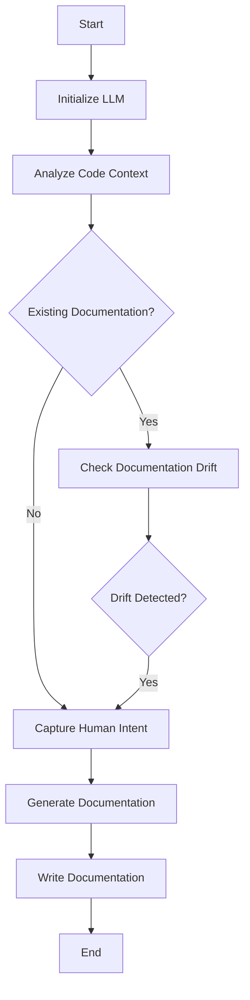

# Dokken Documentation Generation and Drift Detection Tool

## Main Entry Points

Developers interact with Dokken through two primary CLI commands: `dokken generate` for creating new documentation and `dokken check` for detecting documentation drift. These commands support various documentation types like module READMEs, project READMEs, and style guides, and can be configured through `.dokken.toml` configuration files.

## Purpose & Scope

Dokken is an AI-powered documentation generation and drift detection tool designed to help developers maintain accurate and up-to-date documentation for their software projects. The tool analyzes code context, generates structured documentation, and detects when documentation becomes misaligned with the actual codebase.

## Module Structure

- **src/**: Root directory containing core implementation
- **src/llm/**: LLM interaction and prompt management
- **src/config/**: Configuration loading and management
- **src/cache.py**: Caching utilities for expensive operations
- **src/code_analyzer.py**: Code context extraction and analysis
- **src/main.py**: CLI interface and workflow orchestration

## Architecture Overview

Dokken is structured as a modular system with distinct components responsible for different aspects of documentation generation and drift detection. The architecture is designed to be flexible, extensible, and leverage AI for intelligent documentation maintenance. Key architectural components include code analysis, configuration management, LLM interaction, documentation generation, and drift detection workflows.

## Control Flow

The documentation generation workflow follows a multi-stage process: 1) Initialize LLM client, 2) Analyze code context, 3) Check for existing documentation drift, 4) Capture human intent through an interactive questionnaire, 5) Generate structured documentation using AI, and 6) Write documentation to the appropriate output path. The drift detection workflow similarly checks for discrepancies between code and documentation, with optional automatic fixing capabilities.

## External Dependencies

- **llama_index**: Provides LLM client abstractions and text completion programs for structured AI generation
- **pydantic**: Used for creating strongly-typed models and configuration validation
- **click**: Enables rich, composable CLI interface development
- **rich**: Provides advanced console output formatting and status indicators

## Key Design Decisions

Dokken was designed with several critical architectural choices to ensure robust and intelligent documentation generation. The system uses a content-based caching mechanism to reduce redundant LLM API calls, improving performance and cost-efficiency. By leveraging AI and structured Pydantic models, Dokken can generate high-level, conceptual documentation that focuses on architectural patterns rather than implementation details. The modular architecture allows easy extension to support different documentation types and customization through configuration files.
