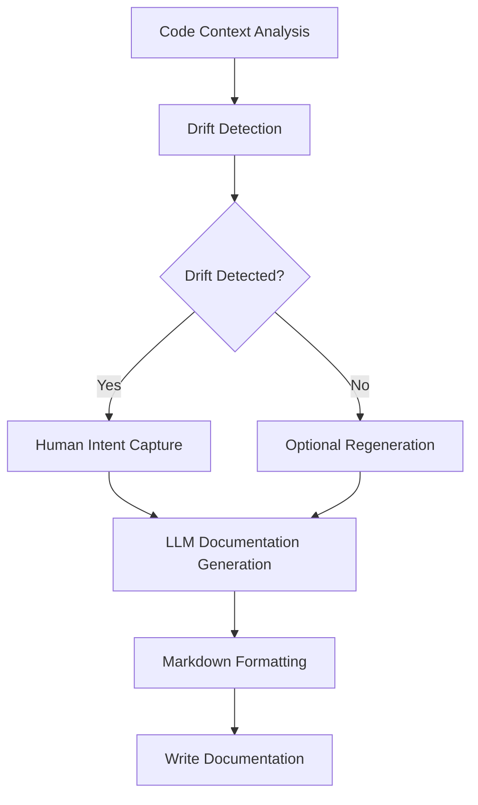

# Dokken Documentation Generation and Drift Detection Tool

## Main Entry Points

Developers interact with Dokken through two primary CLI commands: 'generate' and 'check'. The 'generate' command creates new documentation by analyzing code context, while the 'check' command detects and optionally fixes documentation drift. Users can specify module paths, documentation types (module README, project README, style guide), and additional parameters like analysis depth.

## Purpose & Scope

Dokken is an AI-powered documentation generation and drift detection tool designed to help developers maintain accurate and up-to-date documentation for their software projects. The tool analyzes code context, generates high-level architectural documentation, and detects when documentation becomes misaligned with the actual codebase.

## Architecture Overview

The system is structured around several key modules that work together to provide comprehensive documentation support. The core architecture includes a code analysis module for extracting context, an LLM (Large Language Model) interaction layer for generating documentation, a configuration management system, and workflow orchestration components. Each module has a specific responsibility: code analysis extracts meaningful context, LLM interaction generates and refines documentation, and workflow modules coordinate the overall documentation generation and drift detection process.

## Control Flow

The documentation generation workflow follows a multi-stage process. It begins with code context analysis, where the system extracts relevant code information. Next, it checks for existing documentation and potential drift. A human intent capture step allows developers to provide additional context. The LLM then generates structured documentation based on the code context and human input. Finally, the documentation is formatted and written to the appropriate output file.

## External Dependencies

**LLM Libraries**: Dokken relies on llama-index for LLM interactions, supporting multiple providers like Anthropic Claude, OpenAI GPT, and Google Gemini. **Rich**: Used for creating beautiful, informative CLI output. **Click**: Provides a robust framework for building the command-line interface.

## Key Design Decisions

Dokken adopts a modular, extensible architecture that prioritizes conceptual documentation over implementation details. By using an LLM with carefully crafted prompts, the tool generates high-level, developer-friendly documentation that focuses on architectural patterns and system design. The use of content-based caching for expensive LLM operations ensures efficiency, while the incremental drift fixing approach maintains documentation consistency and minimizes unnecessary regeneration.

